<!-- Erzeugt von tools/readme-bauen.mjs. Texte in tools/README.vorlage.md ändern, dann neu bauen. -->
<h1 lang="de"><picture><source media="(prefers-color-scheme: dark)" srcset="assets/titel-dunkel.svg">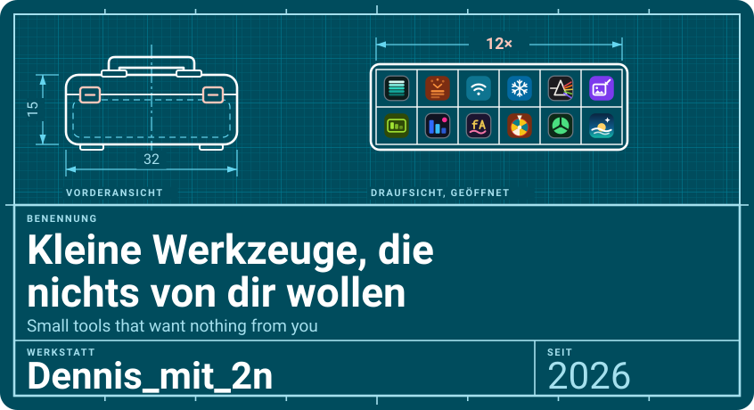</picture></h1>

<a href="https://dennismit2n.github.io/"><picture><source media="(prefers-color-scheme: dark)" srcset="assets/knopf-dunkel.svg"></picture></a>

[dennismit2n.github.io](https://dennismit2n.github.io/)

<h2 lang="de"><picture><source media="(prefers-color-scheme: dark)" srcset="assets/balken-ueber-mich-dunkel.svg"></picture></h2>

<table><tr><td>

Ich bin Dennis, im Netz Dennis_mit_2n. Meine Werkzeuge wollen nichts von dir: keine Anmeldung, keine Anzeigen. Ich baue sie zusammen mit Claude – verstehen möchte ich sie trotzdem. Die Namen sind fast alle von mir selbst ausgedacht. Nur ich möchte was von dir: Verbesserungsvorschläge.😉

I’m Dennis, online as Dennis_mit_2n. My tools want nothing from you: no sign-up, no ads. I build them together with Claude – but I’d still like to understand them. I came up with almost all of the names myself. I’m the one who’d like something from you: suggestions for improvement.😉

</td></tr></table>

<h2 lang="de"><picture><source media="(prefers-color-scheme: dark)" srcset="assets/balken-werkzeugkiste-dunkel.svg"></picture></h2>

<a href="https://dennismit2n.github.io/spectroton/"><picture><source media="(prefers-color-scheme: dark)" srcset="assets/karten/spectroton-dunkel.svg">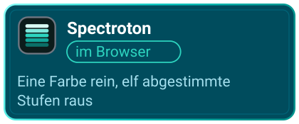</picture></a><a href="https://github.com/Dennismit2n/create-masterprompt"><picture><source media="(prefers-color-scheme: dark)" srcset="assets/karten/masterprompt-dunkel.svg">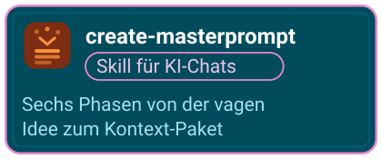</picture></a><a href="https://dennismit2n.github.io/wifi-qr/"><picture><source media="(prefers-color-scheme: dark)" srcset="assets/karten/wifi-dunkel.svg">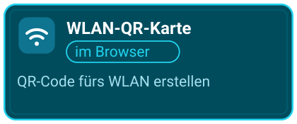</picture></a><a href="https://github.com/Dennismit2n/Real_RAM_cooler/releases/latest"><picture><source media="(prefers-color-scheme: dark)" srcset="assets/karten/ram-dunkel.svg">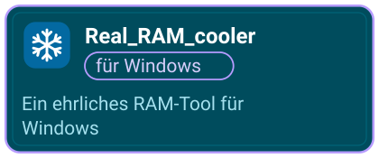</picture></a><a href="https://dennismit2n.github.io/prismatical/"><picture><source media="(prefers-color-scheme: dark)" srcset="assets/karten/prismatical-dunkel.svg">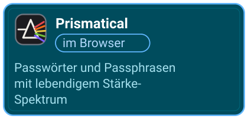</picture></a><a href="https://dennismit2n.github.io/shrinkling/"><picture><source media="(prefers-color-scheme: dark)" srcset="assets/karten/shrink-dunkel.svg">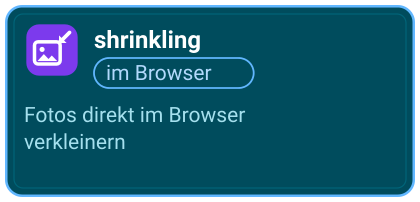</picture></a><a href="https://dennismit2n.github.io/zaehlwerk/"><picture><source media="(prefers-color-scheme: dark)" srcset="assets/karten/zaehlwerk-dunkel.svg">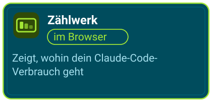</picture></a><a href="https://github.com/Dennismit2n/besucher-ticker/releases/latest"><picture><source media="(prefers-color-scheme: dark)" srcset="assets/karten/ticker-dunkel.svg">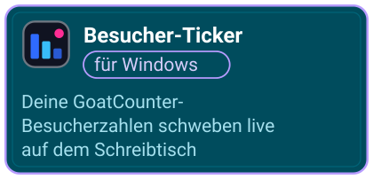</picture></a><a href="https://dennismit2n.github.io/fontART-demo/"><picture><source media="(prefers-color-scheme: dark)" srcset="assets/karten/fontart-dunkel.svg">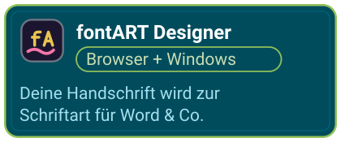</picture></a><a href="https://dennismit2n.github.io/dreh-das-rad/"><picture><source media="(prefers-color-scheme: dark)" srcset="assets/karten/rad-dunkel.svg">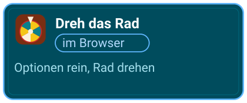</picture></a><a href="https://dennismit2n.github.io/collective-calc/"><picture><source media="(prefers-color-scheme: dark)" srcset="assets/karten/collective-dunkel.svg">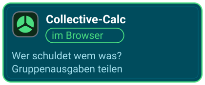</picture></a><a href="https://dennismit2n.github.io/bigday/"><picture><source media="(prefers-color-scheme: dark)" srcset="assets/karten/bigday-dunkel.svg">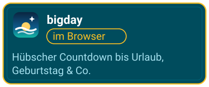</picture></a>

Zu Zählwerk gehört der <a href="https://github.com/Dennismit2n/zaehlwerk-ticker/releases/latest">Zählwerk Ticker</a> für Windows. Was sich zuletzt getan hat und wie jedes Werkzeug funktioniert: <a href="https://dennismit2n.github.io/werkstatt.html">Neuigkeiten &amp; Anleitungen</a>

<h2 lang="de"><picture><source media="(prefers-color-scheme: dark)" srcset="assets/balken-werkbank-dunkel.svg"></picture></h2>

<table lang="de">
<tr><th align="left" scope="row">Gelernt</th><td>selbst beigebracht, mit KI als Lernhilfe</td></tr>
<tr><th align="left" scope="row">Sprachen bisher</th><td>HTML, JavaScript, TypeScript, CSS, Python, PowerShell – dazu etwas Batch und Inno Setup</td></tr>
<tr><th align="left" scope="row">Werkzeuge</th><td>VS Code, Git und GitHub, Claude Code, Electron</td></tr>
<tr><th align="left" scope="row">Gebaut auf</th><td>einem Windows-11-Laptop</td></tr>
<tr><th align="left" scope="row">Getestet auf</th><td>einem Android-Handy und einem Android-Tablet mit Stift</td></tr>
</table>

<b>In English</b>

### The toolbox

1. <a href="https://dennismit2n.github.io/spectroton/"> <b>Spectroton</b></a> · in your browser One colour in, eleven matching shades out – checked for text contrast.
2. <a href="https://github.com/Dennismit2n/create-masterprompt"> <b>create-masterprompt</b></a> · skill for AI chats Six phases from a vague idea to a context package – a fresh chat carries on with no history.
3. <a href="https://dennismit2n.github.io/wifi-qr/"> <b>WiFi QR Card</b></a> · in your browser Create a QR code for your WiFi – guests scan and they’re in.
4. <a href="https://github.com/Dennismit2n/Real_RAM_cooler/releases/latest"> <b>Real_RAM_cooler</b></a> · for Windows An honest RAM tool for Windows – the placebo button is labeled as such.
5. <a href="https://dennismit2n.github.io/prismatical/"> <b>Prismatical</b></a> · in your browser Passwords and passphrases with a live strength spectrum – the colour shows you how strong they are.
6. <a href="https://dennismit2n.github.io/shrinkling/"> <b>shrinkling</b></a> · in your browser Shrink photos right in your browser – for email, applications, classifieds.
7. <a href="https://dennismit2n.github.io/zaehlwerk/"> <b>Zählwerk</b></a> · in your browser Shows where your Claude Code usage goes: by day, model and project. Plus the [Zählwerk Ticker](https://github.com/Dennismit2n/zaehlwerk-ticker/releases/latest) for Windows.
8. <a href="https://github.com/Dennismit2n/besucher-ticker/releases/latest"> <b>Besucher-Ticker</b></a> · for Windows Your GoatCounter visitor numbers floating live on your desktop – pageviews, bars per page, countries or referrers.
9. <a href="https://dennismit2n.github.io/fontART-demo/"> <b>fontART Designer</b></a> · in your browser and for Windows Turn your handwriting into a real font for Word &amp; co. – draw it, export it, install it.
10. <a href="https://dennismit2n.github.io/dreh-das-rad/"> <b>Dreh das Rad</b></a> · in your browser Options in, wheel spins, fate decides – shareable as a link.
11. <a href="https://dennismit2n.github.io/collective-calc/"> <b>Collective-Calc</b></a> · in your browser Who owes whom what? Split group expenses – no account, no app, shareable as a link.
12. <a href="https://dennismit2n.github.io/bigday/"> <b>bigday</b></a> · in your browser A pretty countdown to vacation, birthday &amp; more – shareable as a link.

What’s new and how each tool works: [News & guides](https://dennismit2n.github.io/werkstatt.html)

### The workbench

<table>
<tr><th align="left" scope="row">Learned</th><td>self-taught, with AI as my tutor</td></tr>
<tr><th align="left" scope="row">Languages so far</th><td>HTML, JavaScript, TypeScript, CSS, Python, PowerShell – plus a bit of Batch and Inno Setup</td></tr>
<tr><th align="left" scope="row">Tools</th><td>VS Code, Git and GitHub, Claude Code, Electron</td></tr>
<tr><th align="left" scope="row">Built on</th><td>a Windows 11 laptop</td></tr>
<tr><th align="left" scope="row">Tested on</th><td>an Android phone and an Android tablet with a stylus</td></tr>
</table>

To be honest: the browser tools count visits anonymously with GoatCounter – no cookies, never what you enter; Collective-Calc also counts a few steps such as “link shared”, without names or amounts. Prismatical doesn’t count at all. Beyond that, Spectroton sends the chosen colour (and, when you search by name, your search term) to api.color.pizza to find its name, and Prismatical checks passwords with Have I Been Pwned only if you switch it on – even then only five characters of the hash leave your device, never the password. The Besucher-Ticker fetches your own numbers from GoatCounter with your token; the token stays on your computer. This page loads nothing from other servers: no counters, no stats, every image lives in this repo.

Ehrlich gesagt: Die Werkzeuge im Browser zählen Aufrufe anonym mit GoatCounter – ohne Cookies, ohne deine Eingaben; Collective-Calc zählt zusätzlich ein paar Schritte wie „Link geteilt“, ohne Namen oder Beträge. Prismatical zählt gar nicht. Darüber hinaus schickt Spectroton die gewählte Farbe (und bei der Namenssuche deinen Suchbegriff) an api.color.pizza, um ihren Namen zu finden, und Prismatical prüft Passwörter nur auf Wunsch bei Have I Been Pwned – selbst dann verlassen nur fünf Zeichen des Hashs dein Gerät, nie das Passwort. Der Besucher-Ticker holt deine eigenen Zahlen mit deinem Token von GoatCounter; der Token bleibt auf deinem Rechner. Diese Seite lädt nichts von fremden Servern: kein Zähler, keine Statistik, alle Bilder liegen hier im Repo.

Danke euch allen für die Inspiration. Thanks to all of you for the inspiration. © 2026 Dennis_mit_2n

